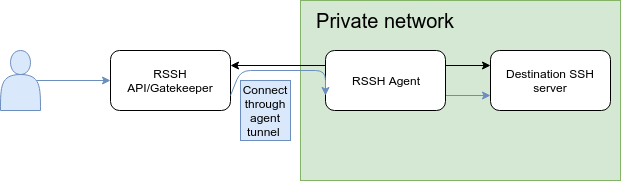

# RSSH

Reverse SSH gateway. SSH into any host in a private network by installing an agent
that will maintain a reverse SSH session on a public server.



## Quickstart

0. Start the RSSH API & Gatekeeper

```sh
git clone https://github.com/Xide/rssh.git
cd rssh
docker-compose up --build
```

1. Register your subdomain
```sh
go build

# baguette.localhost is the default specified in `.rssh.yml`
# It will register 127.0.0.1:22 by default. If
# you wish to expose another host, you can use
# the `--host` and `--port` arguments
./rssh agent register -d subdomain.baguette.localhost

>> 2019-02-10T03:39:43+01:00 INF Register new endpoint Host=127.0.0.1 Port=22 domain=subdomain.baguette.localhost
>> 2019-02-10T03:39:43+01:00 INF Persisted credentials to disk. domain=subdomain.baguette.localhost

./rssh agent ls

>> |-----------------------------------------------------------------------------|
>> | Domain                               | UID                                  |
>> |-----------------------------------------------------------------------------|
>> | subdomain.baguette.localhost         | a6ea341f-9b6d-413f-82be-da0ba214c831 |
>> |-----------------------------------------------------------------------------|

# Start to expose all the registered domains so far

./rssh agent

>> 2019-02-10T03:48:11+01:00 INF Starting RSSH agent. root-dir=/home/billy/.rssh
2019-02-10T03:48:11+01:00 INF Finished hosts import. hosts_count=1
>> 2019-02-10T03:48:11+01:00 INF Established forwarding. domain=subdomain.baguette.localhost host=127.0.0.1 port=22
```


2. Connect through RSSH
```sh
cat >> ~/.ssh/config << EOF
Host *.baguette.localhost
    ProxyCommand ssh -p 2223 127.0.0.1 %h
    StrictHostKeyChecking no
    UserKnownHostsFile=/dev/null

EOF

ssh subdomain.baguette.localhost
```


3. Cleanup
```sh

# Remove subdomain identity from agent known hosts
./rssh agent rm subdomain.baguette.localhost

>> 2019-02-11T15:56:31+01:00 INF Identity removed

# Two down to force volumes deletion
docker-compose down; docker-compose down;
```

## Configuration

See `.rssh.yml`

### Environment variables

You can use override any default and configuration sourced variable with the environment.
All environment variables are prefixed with `RSSH_`, and their name is constructed by taking
the capitalized dot separated path of your variable in `.rssh.yml`.
(e.g: `gatekeeper.ssh_port_range` => `RSSH_GATEKEEPER_SSH_PORT_RANGE`)

## TODO

*Agent*:

- [x] ~~Reconnect on hangup~~
- [x] ~~Runtime config synchronization~~
- [x] ~~Proper resources garbage collection~~
- [x] ~~New commands~~ :
    - [x] ~~list identities~~
    - [x] ~~remove identities~~
- [ ] daemon

*Gatekeeper*:

- [x] ~~HostsKey file~~

*API*:

- [ ] HTTPS

*Global*:

- [ ] More logging
- [x] ~~Proper README~~
- [ ] Guides
- [ ] CI/CD
- [ ] Multiple API's / Gatekeepers
- [ ] Agent multi OS compatibility
- [ ] bash / zsh completions
- [ ] Etcd authentication